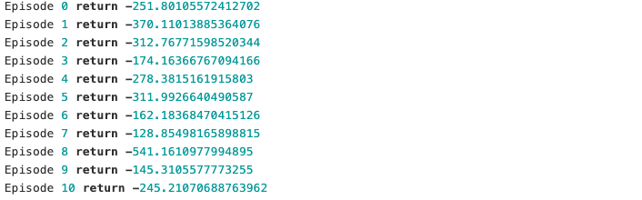
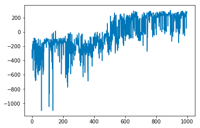

Lunar Lander V2
@Author: Maite Sánchez Fornaris
<h1>Train a Lunar Lander V2</h1>
<h3>@Author: Maite Sánchez Fornaris</h3>

This assignment asks that you code a RL agent using the OpenAI gym environment Lunar Lander.
    For this task you must use a neural network to represent the value function similar to what we saw
    in the DQN lecture. You can provide your solution in either PyTorch or TensorFlow.
    You will need to deliver your code and plots showing the reward your agent achieves. This
    environment is considered solved when the agent gets a reward of 200.

<h2>Requirements:</h2>
<ul>Python 3.6</ul>
<ul>random</ul>
<ul>sys</ul>
<ul>time</ul>
<ul>collections.deque</ul>
<ul>collections.defaultdict</ul>
<ul>collections.namedtuple</ul>
<ul>numpy</ul>
<ul>pandas</ul>
<ul>gym</ul>
<ul>Torch</ul>
<ul>torch.nn</ul>
<ul>torch.nn.functional</ul>
<ul>torch.optim</ul>
<ul>matplotlib</ul>

<h2>Useful information:</h2>

<ul> Create the gym environment 'LunarLander-v2'</ul>
<ul> Create a neural network with the following characteristics:
    <ul> Feed forward (Linear, Dense)</ul>
    <ul> Input (size = environment shape) -> Layer of 32 neurons, -> Output layer (size = action space
size)</ul>
    <ul> Loss 'mse', optimizer 'adam'</ul>
</ul>
<ul> Use e-greedy</ul>
<ul> Use experience replay. It is possible to train a NN using single experiences but neural networks
really like to see at least 32 inputs at once, so that they can properly compute averages, and
learn in a stable way.</ul>
<ul> Print out the cumulative reward of each run. This should look something like this:<ul>
     
<ul> Plot the reward. A correct solution should look like this:</ul>
    

